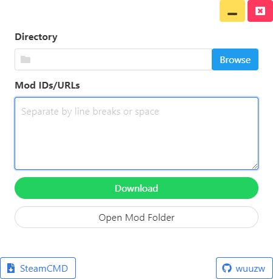

# Mod Downloader

A simple tool for downloading Steam mods

**ONLY support gameS that allow public download through the Steam API**


## Requirement

[SteamCMD](https://developer.valvesoftware.com/wiki/SteamCMD) is needed for this tool to work.

### Download

Get the [latest release](https://github.com/Flipppzw/ModDownloader/releases).

## Build From Source

You must have [Node.js](https://nodejs.org/en/) installed on your system, download or clone the repository and run the following in the root folder.

```bash
npm i
electron-forge make
```

You will find an .exe file in the out/make/squirrel.windows/ folder.

## License

This project is licensed under the MIT License - see the [LICENSE.md](LICENSE.md) file for details
